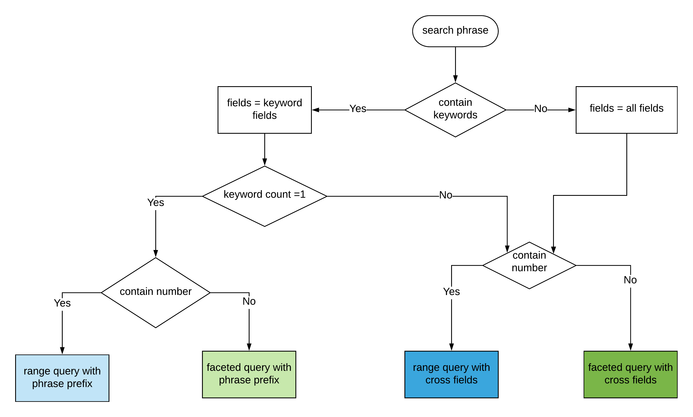

# CS4642 - Data Mining & Information Retrieval
# Sri Lankan Cricketer Search Engine: IR Project Report

Sri Lankan Cricketers Search Engine using ElasticSearch and Python for IR Project(CS4642)

## Getting Start
### Setting up the Environment
* Download and Install the _ElasticSearch_
* Install the _ICU_Tokenizer_ plugin on the ElasticSearch
* Install the _python3_ with _pip3_
* Install the python packages in the _requirements.txt_

### Running the Project
1. First start the ElasticSearch locally on port 9200.
2. Then run **_indexing.js_** file to create the index and insert data.
3. Next run the **_main.py_** to start the search engine
4. Then visit http://localhost:5000/ for see the user interface.
5. Finally add your search query in the search box for searching.

## Project Architecture

Following figure shows how the search engine works through the flask server.

## Indexing & Query techniques

### Indexing
* 'ICU_Tokenizer’ which is a standard tokenizer and which has better support for Asian languages to tokenize text into the words. 
* Elastic search ‘edge_ngram’ filter was used to generate n-grams. 

### MultiSearch with Rule Base classification
Rule-based text mining is used to understand and extract data from the user entered query
string. 

A basic set of rules are applied to each search phrase to identify the keywords, classify them into relevant search types. Acoording to the classification user query was classified to one of the following query type.
    
    1.Range query with Cross Fields
    2.Faceted query with Cross Fields
    3.Range query with phrase-prefix
    4.Faceted query with phrase-prefix
    
Follwing diagram further shows the use of Rule Based Classification and Multisearch queries.

